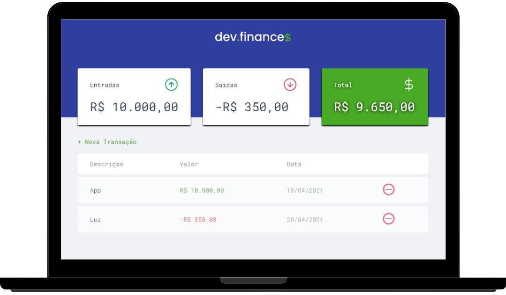

<h1 align="center">
    
</h1>

    <a href="#tecnologias">Tecnologias</a>&nbsp;&nbsp;&nbsp;|&nbsp;&nbsp;&nbsp;
    <a href="#projeto">Projeto</a>&nbsp;&nbsp;&nbsp;|&nbsp;&nbsp;&nbsp;
    <a href="#layout">Layout</a>&nbsp;&nbsp;&nbsp;|&nbsp;&nbsp;&nbsp;
    <a href="#licença">Licença</a>

    
    </img>

    

<h2 id="tecnologias">Tecnologias</h2>

Esse projeto foi Desenvolvido com as seguintes tecnologias:

- HTML
- CSS
- JavaScript

<h2 id="projeto">Projeto</h2>

O dev.finances é uma aplicação de controle financeiro, onde é possível cadastrar e excluir transações e ver o saldo de entrada e saída 💰

<h2 id="layout">Layout</h2>

Você pode vizualizar o layout do projeto através <a href="https://www.figma.com/file/7Vu9DzUaCZIV4nibzkjgB4/dev.finance%24-Maratona-Discover?node-id=0%3A1">desse link</a>

<h2 id="licença">Licença</h2>

Esse projeto está sob a licença MIT. Veja o arquivo <a href="https://github.com/William-AViana/dev.finances/blob/main/LICENSE">LICENSE</a> para mais detalhes.

<h2>☁️ Deploy:</h2>
https://williamprogramador-dev-finances.netlify.app/
